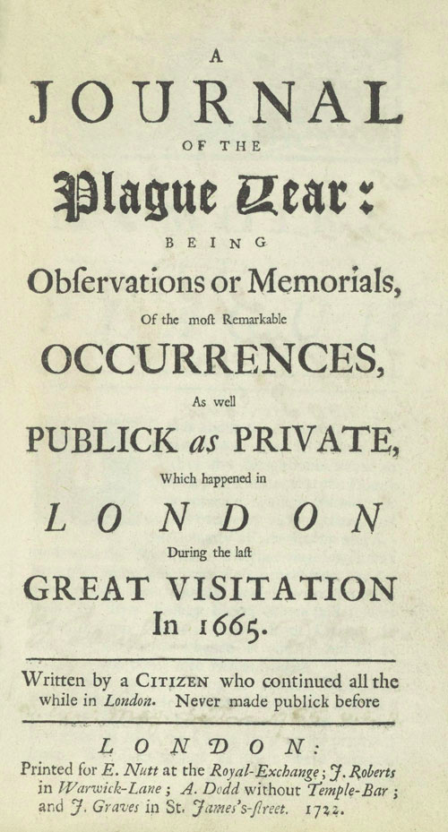

```{r setup, include=FALSE}
knitr::opts_chunk$set(echo = TRUE)
```

## La crónica de Daniel Defoe

En **Diario del año de la peste**, Daniel Defoe narró cómo vivió (y sobrevivió) la peste bubónica de Londres en 1665. Hay quienes dicen que es una crónica y quienes dicen que es una novela. Defoe construyó un narrador testigo, en primera persona, que se llama H. F. La publicación es de 1722. Dejo aquí abajo la tapa del libro (Figura 1), para entender cómo fue presentado por el autor y su editor: _"Diario del año de la peste: siendo observaciones o memorias de los sucesos más importantes, tanto públicos como privados, que ocurrieron en Londres durante la última gran visita en 1665. Escrito por un ciudadano que permaneción todo el período en Londres. Nunca hecho público antes"_ (traducción propia).  En mi opinión, el libro es una crónica o a lo sumo una novela de no-ficción.

A lo largo de la crónica, se incluyen tablas similares a las que estamos viendo ahora con #covid19: número de muertes en Londres o por parroquia (cada parroquia es como un barrio), cantidad de parroquias afectadas, etc. A diferencia de #covid19 (en donde se plantea un modelo de población susceptible, casos activos, recuperados/no-susceptibles y muertes), la peste bubónica fue sumamente letal, entonces en el relato de Defoe los casos de peste bubónica se corresponden con los casos de muerte. 

El libro fue publicado hace casi trescientos años por lo que tiene los derechos liberados. En inglés, está publicado libremente en el [proyecto Gutenberg] (https://www.gutenberg.org/files/376/376-h/376-h.htm). Lo leí en castellano pero consulté el original --por ejemplo, la tapa no está presente en mi edición--.

<center>

{width=30%}

</center>


## Motivación

Las motivaciones de este mini proyecto son múltiples y tiene que ver con algunas de mis actividades e intereses de cuarentena: 

* Leí mucha literatura de la peste y otras plagas, mayormente ficción y también papers. La crónica de Defoe fue una de mis lecturas: la similitud de las bases de datos me daba ganas de verlos graficados, como en los informes diarios del Twitter de Jorge Aliaga (@jorgeluisaliaga) o de Juan Andrés Fraire (@TotinFraire).
+ Participé por primera vez de un encuentro de **#RLadies**, en donde Yanina Bellini y Marysol Gatti de los capítulos de Santa Rosa y General Pico expusieron sobre cómo usar RStudio con control de versiones. La charla está acá: https://yabellini.netlify.app/es/post/githubconr/. Me pareció una buena idea practicar lo de Git con un proyecto concreto (sí, también tengo proyectos de mi laburo/línea de investigación, pero siempre es posible dispersarse).
+ Del material de encuentros anteriores de #RLadies estoy intentanto incorporar otras sugerencias: usar proyectos en R y usar RMarkDown.
+ Participé como estudiante externa de la serie de clases **Ready4R** de Ted Laderas, en la que vimos sobre todo tidyverse y ggplot2. Si bien soy usuaria de R hace muchos años, me di cuenta de que me estanco siempre en cosas básicas como manejo y emprolijamiento de bases de datos, o como entender la sintaxis para graficar. Así que en este proyecto intenté usar algunas herramientas de ese curso.
+ Es una excusa, pero a veces los plazos límites sirven. Hay una convocatoria llamada **#30díasdegráficos** de @R4DS_es. 
 
## Origen de los datos
Daniel Defoe publicó tablas en su crónica/novela, en un formato bastante prolijo para el tipo de literatura. Iba a pasar las tablas a una planilla, pero por suerte encontré el proyecto **“A Frightful Number!”** del _Digital Resource Center de Hofstra University_. Es hermoso. Graficaron los datos en un mapa histórico de Londres:
https://drc.hofstra.edu/projects/itinerary/plague-year/index.html

Tabla de datos para clonar: https://github.com/hofstra/itinerary/blob/gh-pages/_data/a-frightful-number-plague.csv

## Script y gráfico
Por ahora lo dejo en el github, luego veo cómo subirlo acá tipo chunk de código.


