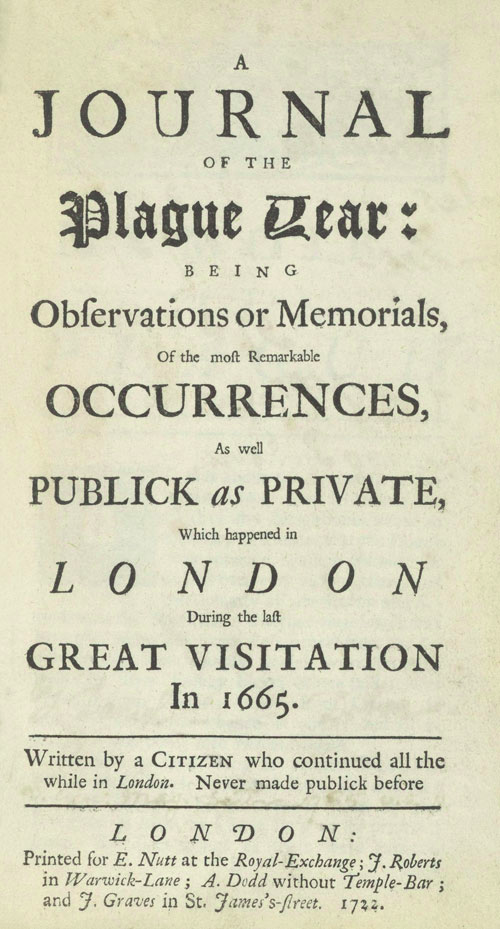

# Visualización de (algunos) datos de "Diario del año de la peste", de Daniel Defoe

Script para graficar los datos de muertes por peste bubónica en 1665 en Londres, según la crónica/novela de no-ficción "Diario del año de la peste" (1722) de Daniel Defoe.

## La crónica/ensayo de Daniel Defoe

En **Diario del año de la peste**, Daniel Defoe narra los acontecimientos que ocurrieron durante la epidemia de peste bubónica de Londres en 1665. Hay quienes dicen que es una crónica o ensayo y quienes dicen que es una novela. Defoe construyó un narrador testigo, en primera persona, que se llama H. F. y que habría sobrevivido a la peste. La publicación es de 1722. Dejo aquí abajo la tapa del libro (Figura 1), para entender cómo fue presentado por el autor y su editor: _"Diario del año de la peste: siendo observaciones o memorias de los sucesos más importantes, tanto públicos como privados, que ocurrieron en Londres durante la última gran visita en 1665. Escrito por un ciudadano que permaneció todo el período en Londres. Nunca hecho público antes"_ (traducción propia).

A lo largo de la crónica, se incluyen tablas similares a las que estamos viendo ahora con #covid19: número de muertes en Londres o por parroquia (cada parroquia es como un barrio), cantidad de parroquias afectadas, etc. A diferencia de #covid19 (en donde se plantea un modelo de población susceptible, casos activos, recuperados/no-susceptibles y muertes), la peste bubónica fue sumamente letal, entonces en el relato de Defoe los casos de peste bubónica se corresponden con los casos de muerte. 

El libro fue publicado hace casi trescientos años por lo que tiene los derechos liberados. En inglés, está publicado libremente en el [proyecto Gutenberg] (https://www.gutenberg.org/files/376/376-h/376-h.htm). Lo leí en castellano pero consulté el original --por ejemplo, la tapa no está presente en mi edición--.

{width=30%}

 
## Origen de los datos
Leí mucha literatura de la peste y otras plagas, mayormente ficción y también papers. La crónica de Defoe fue una de mis lecturas: la similitud de las bases de datos me daba ganas de verlos graficados, como en los informes diarios del Twitter de Jorge Aliaga (@jorgeluisaliaga) o de Juan Andrés Fraire (@TotinFraire).

Iba a pasar las tablas a una planilla, pero por suerte encontré el proyecto **“A Frightful Number!”** del _Digital Research Center de Hofstra University_. Es hermoso. Graficaron los datos en un mapa histórico de Londres:
https://drc.hofstra.edu/projects/itinerary/plague-year/index.html

Tabla de datos para clonar: https://github.com/hofstra/itinerary/blob/gh-pages/_data/a-frightful-number-plague.csv

